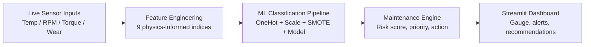

# 🏭 Predictive Maintenance & Reliability Early-Warning System (PM-REWS)

**DCP University Engineering Challenge — Track 2: Predictive Maintenance and Reliability Early-Warning System**
Submitted for the inaugural DCP University Engineering Challenge, set and sponsored by Dangote Cement Plc (DCP), organised by the University of Lagos Engineering Society Academic & Research Board (ULES ARB).

An industrial-grade machine learning pipeline that flags high-risk equipment before failure, built and demonstrated on the AI4I 2020 Predictive Maintenance Dataset (UCI Machine Learning Repository) and mapped to a cement-plant operating context (crushers, raw mills, coal mills, kilns, cement mills, packing equipment).

---

## 1. Why this matters to DCP

Unplanned equipment failures at plants like Obajana, Ibese, Gboko and Okpella reduce throughput, spike maintenance cost, and put safety at risk. PM-REWS gives maintenance and operations teams a simple, practical early-warning signal — a risk score per asset, a priority level, and a recommended action — instead of relying purely on reactive or fixed-interval maintenance.

## 2. How it works — architecture



**Pipeline stages:**
1. **Feature engineering** (`feature_engineering.py`) — derives 9 engineering-informed features from the 5 raw sensor readings: `Thermal_Delta`, `Mechanical_Power_W`, `Accumulated_Stress`, `Temperature_Ratio`, `Power_to_Wear`, `Torque_per_RPM`, `Thermal_Stress_Index`, `Load_Factor`, `Health_Index`.
2. **Preprocessing** (`preprocessing.py`) — `ColumnTransformer` with one-hot encoding for asset type and scaling for numeric features (no manual dummy encoding, no leakage).
3. **Model selection** (`model_selection.py`) — compares Random Forest, Extra Trees, Gradient Boosting, and XGBoost, each wrapped in an `imblearn` pipeline with SMOTE resampling inside stratified 5-fold cross-validation, tuned via `RandomizedSearchCV` on F1.
4. **Threshold optimization** (`evaluation.py`) — selects the decision threshold that maximizes F1 on the precision-recall curve instead of defaulting to 0.5.
5. **Maintenance engine** (`maintenance_engine.py`) — converts a failure probability into a priority (P1/P2/P3), recommended action, estimated downtime, and responsible team.
6. **Dashboard** (`app.py`) — a Streamlit interface where a plant engineer adjusts live asset readings and instantly sees the risk gauge and operational directive.

## 3. Asset Criticality Framework

The AI4I dataset's generic `L / M / H` product-quality tag is reframed as an asset-criticality classification so the model output maps onto real plant equipment:

| Dataset Tag | Asset Criticality Class | Operational Reality | Cement Plant Mapping |
|---|---|---|---|
| **L** | Auxiliary Support Equipment | Failure doesn't impact cement throughput; repairs can be scheduled normally | Packing bag printers, local exhaust fans |
| **M** | Operational Line Assets | Failure halts a specific line; output can be buffered or bypassed for a few hours | Additive weigh feeders, clinker cooling fans |
| **H** | Plant-Critical Asset | Single point of failure — stops the whole plant | Main limestone crusher, raw mill, rotary kiln |

## 4. Dataset

- **Source:** [AI4I 2020 Predictive Maintenance Dataset](https://archive.ics.uci.edu/dataset/601/ai4i+2020+predictive+maintenance+dataset), UCI Machine Learning Repository.
- **Size:** 10,000 records, 14 columns (5 sensor readings, product type, target label, 5 failure-mode flags).
- **Class imbalance:** 3.39% failure rate — handled with SMOTE inside the CV loop to avoid leakage.
- This is a **public benchmark dataset used as a stand-in** for confidential DCP plant telemetry, per the challenge FAQ ("You are not required to have confidential or internal DCP data... use publicly available information and reasonable engineering assumptions"). The five raw sensor fields (temperature, rotational speed, torque, tool wear) are structurally analogous to signals already collected on cement plant rotating equipment (raw mills, kilns, crushers), which is what makes the mapping in Section 3 reasonable as a proof of concept.

## 5. Results

Best model selected automatically by held-out F1 after comparing 4 candidate classifiers under 5-fold stratified cross-validation with SMOTE and randomized hyperparameter search:

| Metric | Value |
|---|---|
| **F1 score** (optimal threshold) | **0.829** |
| **Optimal decision threshold** | 0.921 (selected via precision-recall curve, not a default 0.5) |

*(Full metric breakdown — precision, recall, ROC AUC, PR AUC — and diagnostic plots such as ROC curve, confusion matrix, and feature importance are generated by `evaluation.py` and saved to `outputs/` when `training.py` is run; see Section 7.)*

## 6. Project structure

```
Predictive_Maintenance_Reliability_Early_Warning_System/
├── app.py                  # Streamlit dashboard (live risk scoring UI)
├── training.py              # End-to-end training orchestrator
├── config.py                 # Paths, constants, thresholds
├── feature_engineering.py    # 9 physics-informed engineered features
├── preprocessing.py          # ColumnTransformer pipeline (encode + scale)
├── model_selection.py        # Candidate models + hyperparameter grids
├── evaluation.py             # Metrics + optimal threshold search
├── explainability.py         # Feature/probability explanation logic
├── charts.py                 # Plotly risk gauge and visual components
├── maintenance_engine.py     # Risk score -> priority/action/downtime/team
├── report_generator.py       # Executive report generation
├── utils.py                  # Logging and shared helpers
├── requirements.txt
├── data/
│   └── ai4i2020.csv          # AI4I 2020 dataset (UCI)
├── models/
│   └── pm_rews_pipeline.joblib   # Trained pipeline + threshold + metrics
└── outputs/                  # Evaluation plots generated by training.py
```

## 7. Installation & running

**Requirements:** Python 3.10+

```bash
# 1. Clone and enter the project
git clone https://github.com/SamsonMayomiMatthew/industrial-energy-systems.git
cd industrial-energy-systems/Predictive_Maintenance_Reliability_Early_Warning_System

# 2. Install dependencies
pip install -r requirements.txt

# 3. (Optional) Retrain the model from scratch
python training.py
# This reads data/ai4i2020.csv, runs the full model comparison + SMOTE +
# threshold optimization, and overwrites models/pm_rews_pipeline.joblib

# 4. Launch the dashboard
streamlit run app.py
```

The dashboard opens in your browser. Use the sidebar sliders to set live asset readings (rotational speed, torque, tool wear) and asset criticality level; the risk gauge and operational directive update instantly.

## 8. Maintenance escalation logic

`maintenance_engine.py` converts a model failure probability into a concrete field directive:

| Failure Probability | Priority | Action | Estimated Downtime | Responsible Team |
|---|---|---|---|---|
| > 0.80 | **P1** | Immediate shutdown & inspection | 4–8 hours | Emergency Maintenance |
| 0.40 – 0.80 | **P2** | Scheduled preventative maintenance | 1–2 hours | Day Shift Mechanical |
| < 0.40 | **P3** | Monitor & record data | None | Routine Monitoring |

## 9. Assumptions and data limitations

- Real DCP plant telemetry was not available; the AI4I 2020 public dataset is used as a structural proxy, per the challenge FAQ's explicit allowance for public data and stated assumptions.
- The `L / M / H` asset-criticality mapping (Section 3) is an illustrative example, not a validated DCP asset register; a production deployment would need this table populated and confirmed with DCP reliability engineers per plant.
- Reference values used for baseline risk comparisons (e.g. average torque, RPM, tool wear) are UCI dataset averages, not DCP-specific operating baselines.
- The current model is trained on a single synthetic-line dataset; a production rollout should retrain per equipment class (crusher, raw mill, kiln, etc.) using plant-specific historical failure records once available.

## 10. Implementation roadmap

- **Immediate:** Validate the dashboard and risk logic with DCP reliability engineers; calibrate the `L/M/H` → asset mapping against a real DCP asset register.
- **Short-term:** Pilot on one plant (e.g. Obajana) using historical maintenance logs to retrain the model on real DCP sensor data where available.
- **Medium-term:** Integrate with plant SCADA/historian systems for live streaming input instead of manual slider entry; add per-equipment-class models.

## 11. Tech stack

Python · pandas · NumPy · scikit-learn · imbalanced-learn (SMOTE) · XGBoost · Streamlit · Plotly · Matplotlib · joblib

## 12. License

MIT

## 13. Author

Samson Mayomi Matthew — Final-year Mechanical Engineering student, submitted for the DCP University Engineering Challenge (Challenge 2), Inaugural Edition, 2026.
